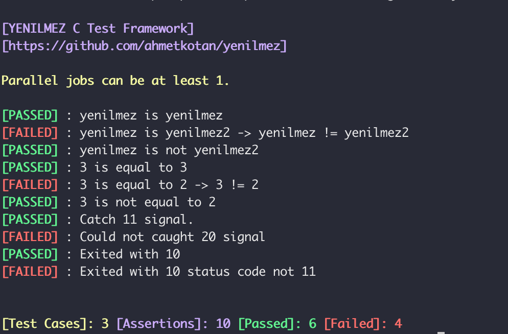

# Usage
This example explains Yenilmez Test Framework basically usage.  

Your functions' name must start with `test_` keyword. Yenilmez discovers your functions with this keyword.

## Compile with CMakeLists.txt
```bash
mkdir -p build
cd build
cmake ..
make
./yenexample
```
```textmate
[PASSED] : Catch 11 signal.
[FAILED] : Could not caught 20 signal
[PASSED] : Exited with 10
[FAILED] : Exited with 10 status code not 11
[PASSED] : 3 is equal to 3
[FAILED] : 3 is equal to 2 -> 3 != 2
[PASSED] : 3 is not equal to 2
[PASSED] : yenilmez is yenilmez
[FAILED] : yenilmez is yenilmez2 -> yenilmez != yenilmez2
[PASSED] : yenilmez is not yenilmez2


[Test Cases]: 3 [Assertions]: 10 [Passed]: 6 [Failed]: 4
```

## Compile with gcc on command line
```bash
gcc yenexample.c $(pkg-config --cflags libyenilmez) $(pkg-config --libs libyenilmez) -o yenexample
```

## Screenshots

